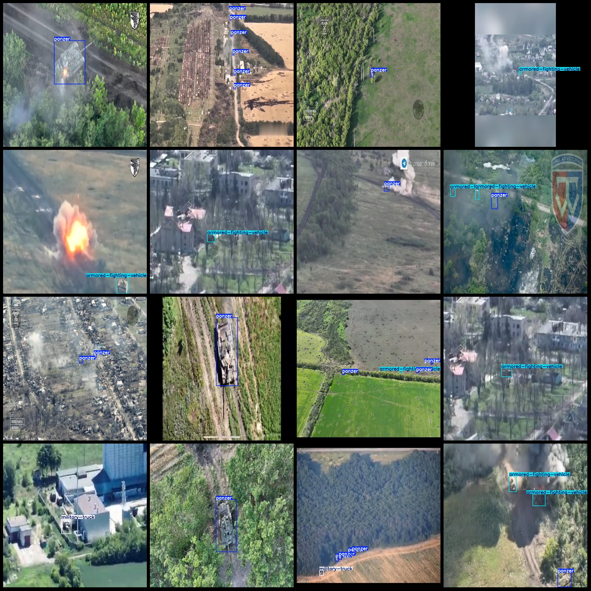
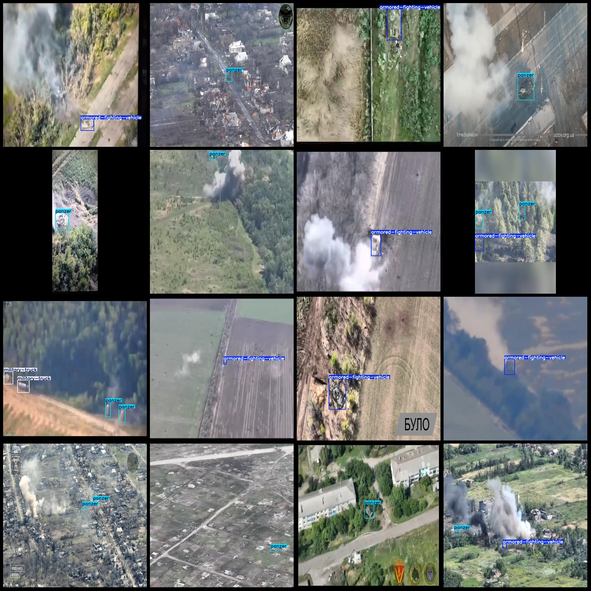

# Drone-Viewpoint Military Target Detection Dataset - VOC+YOLO Format: 5239 Images in 8 Categories

Dataset Format: Pascal VOC format + YOLO format (txt file without segmentation paths, only containing jpg images and corresponding VOC format xml files and YOLO format txt files)
Number of Images (jpg File Count): 5239
Number of Annotations (xml File Count): 5239
Number of Annotations (txt File Count): 5239
Number of Annotation Categories: 8
Annotation Category Names (Note that the order of categories in the YOLO format is not consistent with this, but is based on the labels folder's classes.txt): ["armored-fighting-vehicle", "artillery", "heavy vehicle", "light vehicle", "military-truck", "mlrs", "panzer", "trench"]
Box Count for Each Category:
- Armored fighting vehicle Box Count = 3296
- Artillery Box Count = 10
- Heavy vehicle Box Count = 473
- Light vehicle Box Count = 12
- Military truck Box Count = 641
- MLRS (Multiple rocket launchers system) Box Count = 179
- Panzer Box Count = 4118
- Trench Box Count = 1386
Total Box Count: 10115
Image Resolution: 1280x1280
Annotation Tool Used: labelImg
Annotation Rule: Draw a square around the category
Important Note: No guarantees are made about the accuracy of the trained models or weight files
Special Notice: This dataset does not make any guarantees regarding the accuracy of the trained models or weight files
Image Preview:
## Images

Here is a pay link on Stripe ( https://buy.stripe.com/3cs8yP7sY87d0vu9AB ). Please contact me lonlonago@foxmail.com after funding $89, and I will send you a complete data files , thank you!

